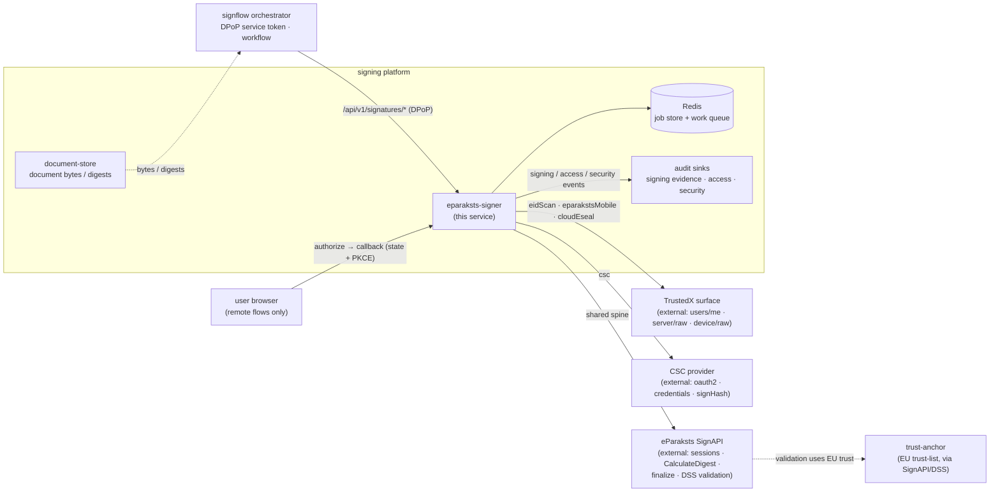
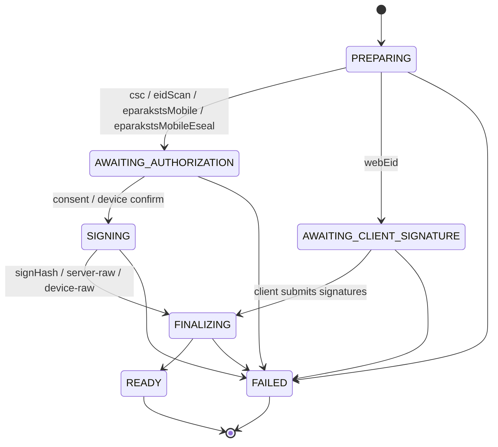
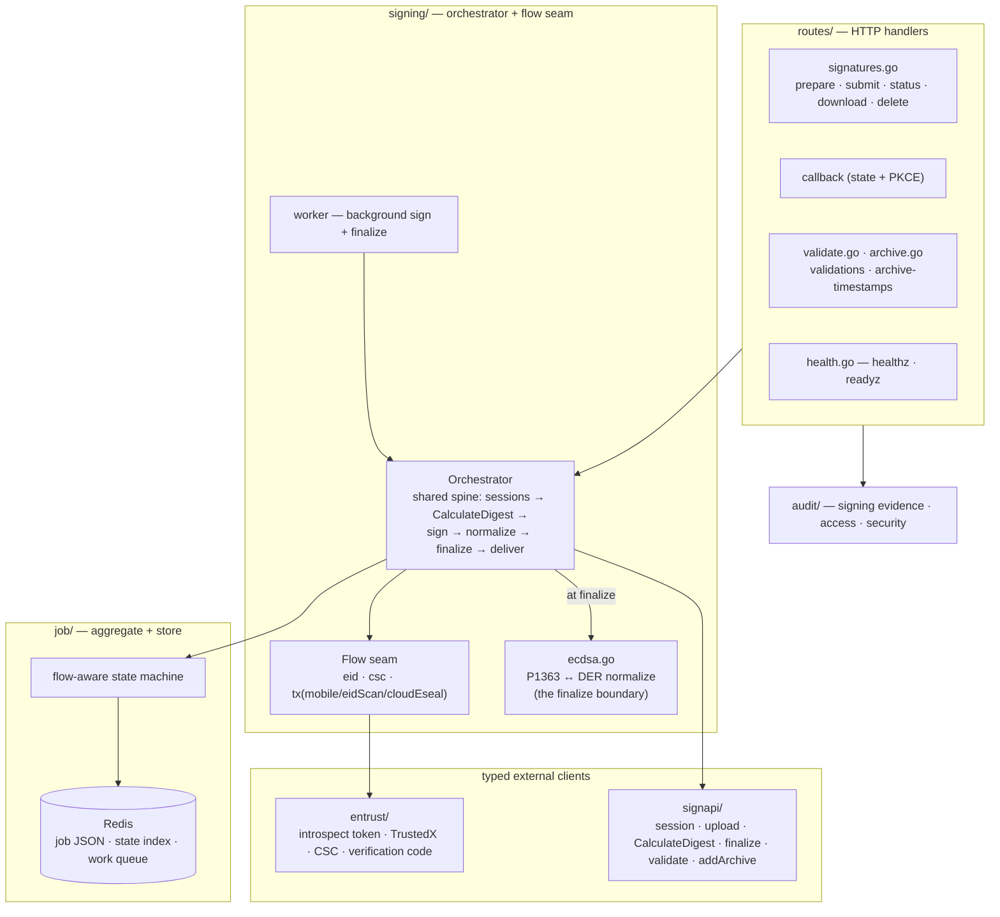

# eparaksts-signer

The **signing service** of the eIDAS signing platform — the one component that turns a caller's "sign this document" request into a qualified electronic signature (or seal) and hands back a standards-compliant signed container. It drives five distinct signing flows over the eParaksts / Entrust family (the local eID card, eID-scan on a phone, eParaksts Mobile, a cloud e-seal, and CSC remote signing), and it produces **XAdES** (ETSI EN 319 132-1), **PAdES** (ETSI EN 319 142-1), and **ASiC-E** (ETSI EN 319 162-1) signatures at the **B-LT** baseline, upgradeable to **B-LTA** by an archive timestamp.

It is a **stateless coordinator**. It holds no document bytes durably, it packages nothing itself, and it performs no raw cryptographic signature. Document bytes and digests live in transient sessions of the external signing/packaging service (**SignAPI**); the actual `SEQUENCE{r,s}` is produced by the qualified signature creation device — the person's eID card, the Entrust HSM behind the QTSP, or a CSC credential. This service owns only the **job lifecycle**, the shared **document spine** (session → calculate-digest → finalize → deliver), the pluggable **flow seam** that supplies the one variable step (obtaining the signature value), and the **ECDSA encoding boundary** where raw signatures are normalized before finalize.

Its state is ephemeral: a job lives in a single Redis key with a bounded TTL, carrying only session ids, opaque digests, transient signature values, and short-lived upstream tokens — never the document bytes, and never a signature value after finalize. Any replica can resume any job from Redis, which is what makes the browser-callback / background-worker split and horizontal scaling safe.

Its HTTP surface is a versioned, service-to-service signing API guarded by a DPoP-bound access token, plus a single browser-facing OAuth callback. It renders no human UI. Two of its endpoints — validate and archive-timestamp — are a deliberate **verbatim relay** of the SignAPI validation report: this service unifies SignAPI's multi-call dance into one call while preserving the exact report payload integrators already parse, so it reshapes nothing.

---

## Where it sits

`eparaksts-signer` is one service in the signing platform. It is driven by the **signflow** orchestrator (which owns the tenant relationship, the signing workflow, and validation-report productization); it receives document bytes or digests sourced from **document-store**; it calls the external **SignAPI** packaging/validation service and, for remote signing, the **CSC provider** and the **TrustedX** surface of the eParaksts platform; and it emits signing evidence, personal-data-access records, and security telemetry to the platform audit sinks.



Division of labour: **signflow** owns the workflow, the caller relationship, and the mapping of the raw validation report into a product answer; it never touches the QTSP directly. **eparaksts-signer** owns everything between a signing request and a signed container — the job state machine, the SignAPI spine, upstream authorization, obtaining the signature, the P1363↔DER normalization, and finalize. The two meet only at the DPoP-guarded `/api/v1/signatures/*` transport. Trust decisions (chain, revocation, timestamp validation) are made inside SignAPI/DSS against the EU trust list; this service does not itself evaluate trust anchors.

---

## The five signing flows

One spine, five flows. Each flow supplies only the variable step — *how the signature value is obtained* — while the orchestrator runs the identical create-session → upload/register → calculate-digest → sign → **normalize to DER** → finalize → deliver sequence for all of them. Each flow's upstream authorization token is the same authenticator the person logs in with, so a login and the signing it drives correlate by name.

| Flow (`?flow=`) | Signer surface | Certificate source | Authorization model | Level |
|---|---|---|---|---|
| `webEid` | local eID card (client-side) | card signing cert, read in the browser | card + PIN, in the browser; digests returned to the caller, signatures submitted back | QES |
| `eidScan` | TrustedX `device/raw` | eID sign identity | two-redirect (profile → use:device) + device push + verification code + poll | QES |
| `eparakstsMobile` | TrustedX `server/raw/batch` | server sign identity | two-redirect (profile → use:server), batch-capable | QES |
| `eparakstsMobileEseal` | TrustedX `server/raw/batch` | qualified e-seal identity | as `eparakstsMobile`, seal identity selected at the profile callback | SEAL |
| `csc` (default) | CSC provider `signHash` | credential certificate chain | `oauth2code` consent + PKCE → credential token | QES |

`webEid` is **client-side**: there is no upstream authorization or signing call — the orchestrator computes the digests, hands them to the caller, and waits for the card's signature to be submitted. The four remote flows bounce the browser through one or two authorize legs, then sign in the background worker. `eidScan` signs exactly one document per job (the device-push primitive is single-digest); the other remote flows are batch-capable. The `csc` flow is feature-gated: with no CSC client id configured, `POST /prepare?flow=csc` returns `501` rather than a broken half-flow, because parts of the CSC provider sequencing (the short-term credential mechanism, the signature-activation-data binding, asynchronous polling) depend on an upstream platform update; the known request/response shapes are implemented and the residual items are marked at their call sites.

### Job state machine

A job is created in `PREPARING`, forks by flow into either a browser-authorization wait or a client-signature wait, is signed and finalized by the background worker, and ends `READY` or `FAILED`. Only the transitions below are permitted; any other is rejected.



---

## HTTP surface

Every `/api/v1/signatures/*` endpoint is service-to-service, gated by a DPoP-bound access token with a per-endpoint scope (`signatures:create` / `:write` / `:read`). The **only** browser-facing endpoint is the OAuth callback — it sits outside the DPoP-guarded group and is secured by the OAuth `state` value plus PKCE. All error responses use the RFC 9457 `application/problem+json` envelope with a stable `code`; the correlation id rides the `X-Correlation-ID` response header.

| Method + path | Scope | Purpose |
|---|---|---|
| `POST /api/v1/signatures/prepare?flow={flow}` | `signatures:create` | Create a job, upload documents (or register hashes), begin the selected flow. Returns an authorize URL (remote flows) or the digests to sign (`webEid`) |
| `GET {callback path}` | none (state + PKCE) | Browser OAuth callback → advance one authorize leg → 302 back to the caller's post-auth / error redirect. Path is derived from the configured redirect URI (default `/api/v1/signatures/callback`) |
| `POST /api/v1/signatures/{jobId}/signatures` | `signatures:write` | Submit the client-produced signature value(s) for `webEid`; enqueues finalize |
| `GET /api/v1/signatures/{jobId}/status?wait={s}` | `signatures:read` | Job + per-document status (optional long-poll, capped at 30 s). Surfaces the `eidScan` verification code, device prompt + deadline while signing |
| `GET /api/v1/signatures/{jobId}/documents/{documentId}?container=edoc\|asice` | `signatures:read` | Download the signed container (or PDF). `edoc` and `asice` select the extension only — same bytes |
| `POST /api/v1/signatures/{jobId}/documents/{documentId}/archive` | `signatures:write` | Add an archive timestamp to a READY job document (B-LT → B-LTA); returns the archived container |
| `DELETE /api/v1/signatures/{jobId}` | `signatures:write` | Delete the job and close its SignAPI sessions (data minimization) |
| `POST /api/v1/validations` | `signatures:read` | Validate an uploaded already-signed document; relays the SignAPI/DSS report **verbatim**. The transient provider session the validation ran in is returned in the `X-Validation-Session` response header — evidence linking the caller's request to the provider-side processing |
| `POST /api/v1/archive-timestamps` | `signatures:write` | Add an archive timestamp to an uploaded already-signed document (B-LT → B-LTA); returns the archived container |
| `GET /healthz` | none | Liveness — 200 whenever the process is up |
| `GET /readyz` | none | Readiness — 503 (plain `{status}` body, never an error envelope) when the orchestrator is unwired or Redis is unreachable |

`prepare` accepts either a `multipart/form-data` body (a JSON `metadata` part plus one file part per document) or a JSON body carrying pre-computed hashes — the confidential path, where the document bytes never leave the caller. A document may itself be an ASiC-E container being co-signed, in which case its inner data objects are registered together under one parallel signature.

For the TrustedX remote flows, a caller that already resolved the person's sign identity (typically at login) may supply `signIdentityId` + `signingCertificate` + `authCertificate` in the metadata: the flow then **skips its identity-resolution leg** — the extra authenticate-and-consent redirect plus the identity and certificate reads — and the first redirect the user sees is already the signature authorization. No trust moves: the provider still binds the identity to the authenticated user at that authorization, so a stale or foreign identity fails there. Anything missing from the trio and the flow resolves identities itself, exactly as before — the supply is an optimization, never a requirement.

**Validate and archive-timestamp** are stateless single-call operations on a *transient* SignAPI session (create → upload → operate → close) — they own no job. Validate uploads a self-contained signed document (a signed PDF, or an ASiC-E container that embeds its signed files) and passes the SignAPI/DSS report through unchanged, including the upstream error body for an unrecognized document. Archive adds an `ARCHIVE_TIMESTAMP` and returns the archived container bytes; its finalize authentication certificate is the signed-in user's certificate — the required `authCertificate` form field, or, for the job-based variant, the certificate captured on the job at signing time. There is no configured fallback: the timestamp request is made in the acting user's name (only the feature-gated CSC flow uses a configured certificate, on its own jobs). A **definitive rejection of the document by the provider** (a SignAPI `4xx` — e.g. the bytes are not a PDF, or the PDF carries no signature to extend) surfaces as a client-actionable **`422 err:signing:invalidDocument`** with a public-safe reason, **not** a `502`: the latter is reserved for a genuinely unreachable upstream. The full provider cause is logged (correlated by trace id) rather than returned raw.

> **Verbatim relay by design.** The validate/archive surface collapses SignAPI's multi-step session dance into one DPoP call while preserving the exact response payload: the full envelope, the original field names and casing, and upstream error bodies. Reshaping the report here (unwrapping, re-casing, date normalization, field selection, verdict labels) would diverge from what SignAPI integrators expect and is intentionally *not* done — that productization belongs to the caller. The contract is versioned and changed only additively.

---

## Architecture

One application object wires every dependency at startup: the Redis job store, the eParaksts platform client (TrustedX + CSC), the SignAPI client, the orchestrator and its background worker, the inbound DPoP auth middleware, and the three audit regimes. All cross-cutting concerns — structured logging with redaction, OpenTelemetry tracing, correlation-id propagation — are installed once by the shared platform kit, never per-service.



The ECDSA normalization sits on exactly one path — inside `finalize`, just before the signature value is sent to SignAPI. Every flow, regardless of whether its signer emits DER or raw `r‖s`, passes through the same detect-and-convert function, so the encoding ambiguity is resolved in one place and never guessed.

---

## Signing spine, end to end

A `webEid` job — the client-side, hash-then-sign flow — from prepare to a downloadable B-LT container. The card signs a digest and returns a raw IEEE P1363 `r‖s` value; the service normalizes it to DER at the finalize boundary. Remote flows (`csc`, `eidScan`, `eparakstsMobile`, `eparakstsMobileEseal`) replace the "client submits signature" leg with an authorize-redirect dance followed by an upstream signing call in the background worker, but the spine either side of it is identical.

```mermaid
sequenceDiagram
    participant SF as signflow orchestrator
    participant GO as eparaksts-signer
    participant SA as SignAPI
    participant CARD as browser + eID card

    SF->>GO: POST /prepare?flow=webEid (DPoP; bytes + signing cert)
    GO->>SA: start session + upload (one session per document)
    GO->>SA: CalculateDigest (signing cert, signAsPdf / createNewEdoc)
    SA-->>GO: opaque digest(s) + signature_algorithm (SCAL2)
    GO->>GO: state → AWAITING_CLIENT_SIGNATURE
    GO-->>SF: 201 { jobId, documents[].digest, signAlgorithm }

    Note over CARD: card signs the digest (PIN) → raw P1363 r‖s
    SF->>GO: POST /{jobId}/signatures (base64 signature value)
    GO->>GO: state → FINALIZING; enqueue background worker

    Note over GO: background worker
    GO->>GO: NormalizeSignatureToDER — P1363 → DER (detect-and-convert)
    GO->>SA: finalizeSigning (DER signature + auth certificate)
    SA-->>GO: B-LT container produced
    GO->>GO: clear transient signature value; state → READY

    SF->>GO: GET /{jobId}/status?wait=… → READY
    SF->>GO: GET /{jobId}/documents/{documentId}
    GO->>SA: list + download signed container
    GO-->>SF: signed ASiC-E (.edoc) / PDF bytes
```

The digest and the digests-summary returned by `CalculateDigest` are **opaque** and echoed back verbatim into the signer and into `finalizeSigning` — never recomputed. This preserves the sole-control assurance (SCAL2) property: the data-to-be-signed the person authorizes is exactly the data that is finalized.

---

## Keys and crypto

The service never holds a signing private key — the key lives in the QSCD (card, HSM, or CSC credential). What it does own is the **encoding boundary** and a set of certificates and short-lived tokens it threads through the spine.

**ECDSA encoding — P1363 `r‖s` vs DER.** eID cards and Web eID emit a raw fixed-width `r‖s` value (IEEE P1363); SignAPI/DSS expect an ASN.1 DER `SEQUENCE{ INTEGER r, INTEGER s }` (RFC 3279 / RFC 5480). Normalization happens in one detect-and-convert function at the finalize boundary, for every flow:

- first byte `0x30` **and** the bytes parse as a complete `SEQUENCE{INTEGER,INTEGER}` with positive `r`,`s` → already DER, passed through;
- total length ∈ {64, 96, 132} (P-256 / P-384 / P-521 raw `r‖s`) → split, strip leading zeros, ASN.1-marshal to DER;
- anything else → a hard `bad signature encoding` failure (never guessed).

The conversion is exercised in both encodings and both branches: the card path (`webEid`) arrives as P1363 and is converted; the TrustedX path arrives as DER and passes through. The input encoding is logged per document (a signature value is public, not a secret), and a raw P1363 value arriving from a non-card flow is flagged as encoding telemetry. The Latvian eID signing key is P-384, so its digest is a 48-byte SHA-384 value.

**Certificates — signing vs authentication.** Two certificates are distinct and never interchanged: the **signing** certificate feeds `CalculateDigest` (it binds the person's key into the data-to-be-signed), while the **authentication** certificate is the finalize `authCertificate` used by SignAPI for timestamp-authority access. For `webEid` the caller supplies both; for the TrustedX flows both are resolved from the person's sign identities; for `csc` the credential's leaf serves as both unless a service certificate is configured. Passing the signing certificate where the auth certificate belongs is rejected by the timestamp authority.

**Upstream tokens.** A process-wide TrustedX **introspect token** (client-credentials, ~600 s, cached and refreshed early) is the Bearer for every SignAPI call. The per-flow OAuth tokens (profile / signing / CSC credential) are **job-scoped**, held in Redis only for the job's TTL, never logged, and never returned to the caller. The `eidScan` device verification code is derived deterministically from the digest — `SHA-256(digest)` → last two bytes mod 10000, zero-padded to four digits — so the code shown on the phone matches the digest being signed.

**Cloud e-seal.** `eparakstsMobileEseal` signs with a qualified e-seal identity (organizational, not personal), recorded at the `SEAL` level in the signing-evidence trail; it is otherwise the server-raw batch flow.

---

## State and data model

There is **no relational database and no durable document storage** in this service. State is a single job aggregate per signing request, stored as one JSON value in Redis under a bounded TTL, plus a work queue the background worker consumes. Document bytes exist only inside the external SignAPI session for the life of the job (and are removed when the job is deleted); a hash-only job never carries bytes at all.

| Redis key | Value | Role |
|---|---|---|
| `job:{jobId}` | the job aggregate (flow, state, sessions, opaque digests, transient signature values, short-lived tokens, subject ref) — **never document bytes** | write |
| `state:{oauthState}` | → `jobId` (OAuth callback correlation) | write; single-use — cleared once the callback consumes it |
| `signer:work` | list of job ids awaiting the background signing worker | LPUSH / BRPOP |

Everything is TTL-bounded; there is no cache-forever key. The transient signature value on each document is cleared immediately after finalize. The signer's national identifier is captured only as a `subjectRef` for pseudonymized access auditing and is never persisted raw.

---

## Configuration

Standard platform env (`SERVICE_NAME`, `ENVIRONMENT`, `SERVER_URLS`, `LOG_*`, `OTEL_*`) comes from the shared base configuration and is not repeated here. Secrets resolve via the `<NAME>_FILE` convention (a mounted file), and an explicit plain env value still overrides it. Service-specific env:

| Env var | Default | Meaning |
|---|---|---|
| `REDIS_URL` | — (required) | Job store + work queue (`redis://host:port/db`) |
| `JOB_TTL` | `1h` | Per-job lifetime; also bounds the short-lived upstream tokens inside a job |
| `AUTH_ISSUER_URL`, `AUTH_JWKS_URL` | — | Inbound DPoP token issuer + JWKS |
| `SERVICE_AUDIENCE` | `svc:eparaksts-signer` | Expected audience of the inbound service token |
| `UPLOAD_HARDENING` | `true` | The **document gate** on every uploaded file, run before anything is forwarded upstream. Validate/archive uploads must be a signed PDF or a signed, well-formed ASiC-E (`.asice`/`.edoc`/`.sce`); signing (prepare) file parts may be any format, but content that claims or appears to be PDF/ASiC-E must actually parse. Rejections are typed (`422 err:signing:uploadRejected`, `413 err:signing:fileTooLarge`) with the detector cause in the detail. Set `false` only when an already-gated edge sits in front |
| `MAX_UPLOAD_BYTES` | `26214400` (25 MiB) | Per-file upload cap (the upstream signing service's per-file limit) |
| `SERVER_MAX_REQUEST_BODY_SIZE` | `67108864` (64 MiB) | Whole-request body cap — sized to fit a multi-file signing preparation (per-file cap × files + multipart overhead) |
| `SIGNAPI_BASE_URL` | — | eParaksts SignAPI base (the shared document spine) |
| `TX_BASE_URL` | — | TrustedX surface base URL |
| `TX_AS_PATH` | `/trustedx-authserver/oauth/lvrtc-eipsign-as` | TrustedX authorization-server path |
| `EPARAKSTS_CLIENT_ID`, `EPARAKSTS_CLIENT_SECRET` (`_FILE`) | — | TrustedX client credentials (shared with the platform login client); also mint the SignAPI introspect token |
| `TX_REDIRECT_URI` | — | Registered OAuth redirect URI; the callback handler **derives its mounted path** from it, so a pre-registered redirect just works |
| `TX_ACR_MOBILE`, `TX_ACR_EIDSCAN`, `TX_ACR_CLOUDESEAL` | eParaksts flow URNs | Per-flow `acr_values` |
| `TX_IDENTITY_FETCH_RETRIES`, `TX_IDENTITY_FETCH_DELAY` | `5`, `2s` | Retry loop while sign identities materialize after login |
| `EIDSCAN_POLL_INTERVAL`, `EIDSCAN_SIGN_DEADLINE` | `2s`, `120s` | Device-push poll cadence + signing deadline (`eidScan`) |
| `CSC_BASE_URL`, `CSC_CLIENT_ID`, `CSC_CLIENT_SECRET` (`_FILE`) | — | CSC provider surface; unset `CSC_CLIENT_ID` ⇒ `csc` flow returns `501` |
| `CSC_AUTH_CERT` (`_FILE`) | — | Interim finalize `authCertificate` for `csc` / a fallback for archive (base64-DER) |
| `DEFAULT_SIGNATURE_QUALIFIER` | `eu_eidas_qes` | Qualifier when the caller omits one |
| `EIDAS_AUDIT_TOPIC` | `audit.signing` | Signing-evidence broker topic |
| `EIDAS_AUDIT_OUTBOX_DIR` | — (empty ⇒ synchronous) | When set, signing-evidence emission is durable + non-blocking: events spool here and a background drainer publishes them. MUST differ from `ACCESS_AUDIT_OUTBOX_DIR` |
| `BROKER_URL`, `BROKER_TLS_CERT/KEY/CA` (`_FILE`) | — | Audit broker (NATS JetStream). Unset ⇒ signing-evidence events go to a dev log transport only (not durably stored) |
| `ACCESS_AUDIT_URL`, `ACCESS_AUDIT_AUDIENCE`, `ACCESS_AUDIT_SCOPE`, `ACCESS_AUDIT_OUTBOX_DIR` | — | Personal-data-access audit (optional; off until `ACCESS_AUDIT_URL` is set) |
| `AUDIT_CLIENT_ID`, `AUDIT_CLIENT_SECRET` (`_FILE`), `AUDIT_ISSUER_URL`, `AUDIT_SUBJECT_PSEUDONYM_KEY` (`_FILE`) | — | Outbound access-audit token mint + the HMAC key that pseudonymizes the data subject |

**TLS is selected by the URL scheme.** `rediss://…` connects over TLS; `redis://…` does not. `skip_verify=true` only relaxes certificate verification on a `rediss://` URL — on a `redis://` URL the client rejects it outright (`redis: unexpected option: skip_verify`) rather than silently upgrading the connection. Earlier Azugo versions did treat `skip_verify=true` as an implicit request for TLS; that side-effect is fixed from **Azugo v0.37** onwards, so a TLS endpoint must always be addressed as `rediss://`.

Configuration is validated at startup and fails closed — a missing required value, a non-URL where a URL is expected, or two audit outboxes pointing at the same directory all stop the process from starting.

---

## Observability and audit

There is no custom Prometheus registry. Telemetry is OpenTelemetry: outbound calls to SignAPI and the eParaksts platform are emitted as client spans through the shared instrumented transport (no-op when tracing is inert), correlation ids propagate on internal hops, and logs are structured with redaction. Probe responses skip the access log.

The service records three audit regimes:

| Regime | What | Sink |
|---|---|---|
| Signing evidence | `signing.initiated / redirect / callback / applied` — signing level (QES\|SEAL) and container format, lean references only | audit broker topic (NATS JetStream) → hash-chained evidence store; dev log transport when no broker configured |
| Personal-data access | each time a signer's certificate/identity is processed, with a **pseudonymized** subject (HMAC of the national id; raw id never logged) | access-audit (optional) |
| Security telemetry | endpoint outcomes (`eparaksts.prepare/sign/validate/archive`) and authorization denials, metadata only | security-event log sink |

Audit is emitted on the request path (the background worker carries no request context); the terminal signing-evidence event is emitted once, from the status endpoint, when a job first reaches READY. Access auditing is fail-open: signing is never broken by audit back-pressure.

---

## Directory layout

```
eparaksts-signer/
├── app.go, config.go              — App container + wiring; env config (validate + fail-closed)
├── auditposter.go, logtransport.go — access-audit HTTP poster; dev broker fallback
├── testing.go                     — in-process test harness
├── cmd/server/                    — CLI entrypoint (web, health subcommands)
├── routes/                        — HTTP handlers
│   ├── router.go                  — route + scope registration (callback outside the DPoP group)
│   ├── signatures.go              — prepare · callback · submit · status · download · delete
│   ├── validate.go, archive.go    — stateless validate + archive-timestamp
│   ├── health.go                  — healthz · readyz
│   └── request/, response/        — inbound / outbound DTOs
├── signing/                       — the orchestrator + the flow seam
│   ├── orchestrator.go            — shared spine (sessions → digest → sign → finalize → deliver)
│   ├── flow.go, flows.go          — Flow interface + eid / csc / TrustedX implementations
│   ├── ecdsa.go                   — P1363 ↔ DER normalization at the finalize boundary
│   ├── operations.go              — stateless validate + archive-timestamp operations
│   └── worker.go                  — background signing worker (Redis work queue)
├── job/                           — job aggregate, flow-aware state machine, Redis store + queue
├── signapi/                       — typed SignAPI client (the shared spine) + wire types
├── entrust/                       — eParaksts platform client: introspect token, TrustedX, CSC,
│                                    identity selection, eidScan verification code
├── audit/                         — three-regime recorder, pseudonymizer, outbox drain tasks
├── Dockerfile                     — static build → rootless scratch (nonroot)
└── .github/workflows/ci.yml       — build · vet · lint · vulnerability scan · race tests +
                                     coverage, then image build → SBOM → image scan →
                                     publish → signature
```

---

## Development

There is no Makefile; the module builds and tests with the standard Go toolchain (the same commands CI runs). Every dependency, including the `gmb-lib/*` modules, is public and network-fetched at its pinned tag, so nothing needs credentials, a `GOPRIVATE` setting or a vendor directory.

```bash
go mod download
go vet ./...
go build ./...
go test -race -count=1 ./...
gofmt -l .            # must print nothing

# Container image (static binary → rootless scratch, nonroot, exposes 8080).
docker build -t eparaksts-signer .
```

The unit suite runs against in-process fakes and covers the parts that must not be trusted to luck: the ECDSA normalization on P-256/P-384 in both encodings, the state-machine transitions, the SignAPI client's retry/verbatim-relay behaviour, TrustedX identity selection, the eidScan verification code, and the CSC request shapes. A live end-to-end signature additionally needs real eParaksts client credentials and a reachable SignAPI base; `LOG_LEVEL=debug` surfaces the SignAPI request/response and the upstream HTTP traces (bodies that carry certificates/digests are logged; Bearer tokens and document bytes never are).

---

## Security invariants

- **No private key, no durable document bytes.** The signing key lives in the QSCD; document bytes live only in a transient SignAPI session and are removed on job deletion. A hash-only job carries no bytes at all.
- **Signature values are transient.** A per-document signature value exists only between submission/signing and finalize, and is cleared immediately after.
- **The digest is opaque (SCAL2).** The data-to-be-signed from `CalculateDigest` is echoed verbatim into the signer and finalize — never recomputed — so the person authorizes exactly what is finalized.
- **One ECDSA encoding boundary.** Every flow's signature is normalized to DER in a single function at finalize; a value that is neither valid DER nor a recognized P1363 width fails hard rather than being guessed.
- **Signing vs auth certificate are never interchanged.** The signing certificate feeds digest calculation; the authentication certificate feeds finalize/timestamp access.
- **DPoP-bound service auth with per-endpoint scopes** on every signing endpoint; the browser callback is guarded instead by single-use OAuth `state` + PKCE. The dev user-token concession is off by default and refuses to be mistaken for production.
- **Upstream tokens are short-lived, job-scoped, never logged, never returned.** The national identifier is pseudonymized (HMAC) before it reaches any access record and is never logged raw.
- **Fail closed at startup** on missing/invalid configuration; **at-most-once finalize and archive** (no retry) to avoid double-signing.

---

## Known limitations

- **`csc` remote signing is feature-gated.** The known request/response shapes are implemented, but the short-term credential mechanism, the signature-activation-data binding, asynchronous polling, and the provider's ECDSA encoding depend on an upstream platform update; until a CSC client id is configured, `prepare?flow=csc` returns `501`. The DER normalization at finalize already makes either provider encoding safe.
- **`eparakstsMobile` / `eparakstsMobileEseal`** share the proven TrustedX machinery (two-redirect, identity selection, finalize) with server-raw batch signing; they are high-confidence but warrant a confirmation run.
- **One document → one signature per session** in this version. Bundling several documents under a single ASiC-E signature (beyond co-signing an existing container) is a follow-up.
- **Cloud e-seal identity ambiguity** for `eparakstsMobileEseal` is detectable only at the profile callback (identities are known only after login), not at prepare time.
- **Validate runs on the uploaded top-level document** — the ASiC-E container or the PDF itself — not an inner file; validating an inner file returns SignAPI's "document format not recognized".
- **Single-node Redis only.** The job store uses ordinary commands against one Redis-protocol endpoint; Redis Cluster is not a target.
---

## Contributing

Bug reports and pull requests are welcome. [CONTRIBUTING.md](CONTRIBUTING.md) names the gate a
change has to pass, the security invariants a change to the signing path must not weaken, and the
sign-off every commit carries.

Suspected vulnerabilities go through the private route in [SECURITY.md](SECURITY.md) — never a
public issue. This service produces legally effective signatures, so that file also says which
failures we treat as most serious, and it is worth reading before deciding whether something you
found is worth reporting.

## Licence

**GNU Affero General Public License, version 3 only** — see [LICENSE](LICENSE).

This is a network service, so the clause worth knowing is the one MIT and GPL do not have: if you
run a modified version and let others interact with it over a network, you must offer those users
the corresponding source of your modified version. Running it unmodified, or modifying it for
internal use with no network users, does not trigger that.
